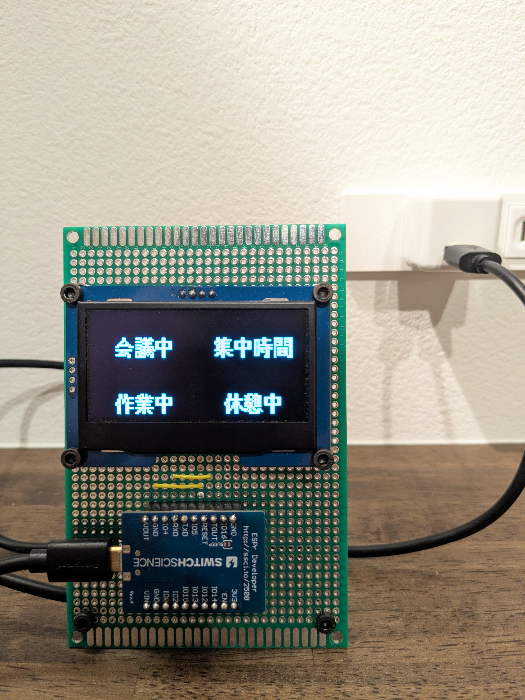
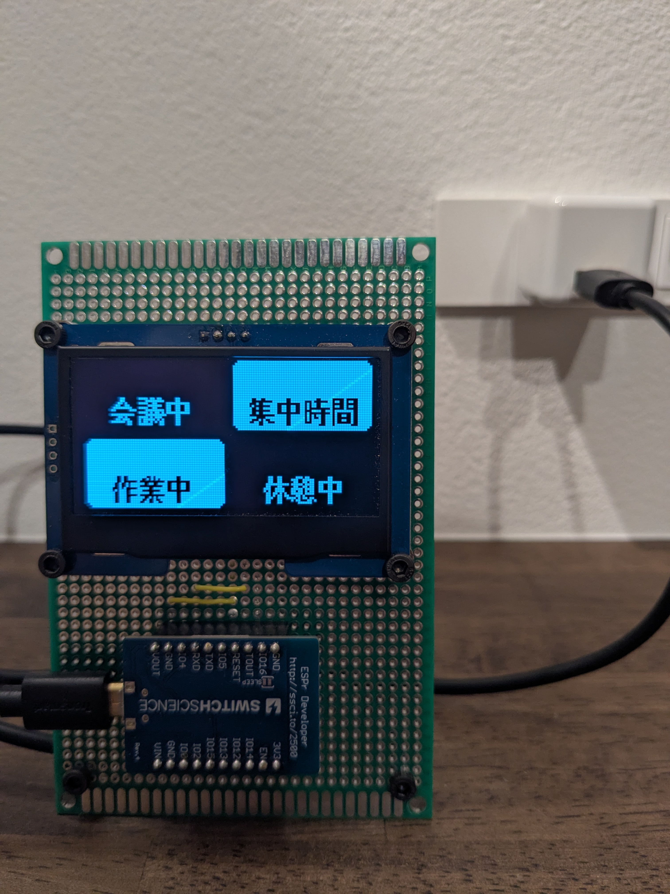
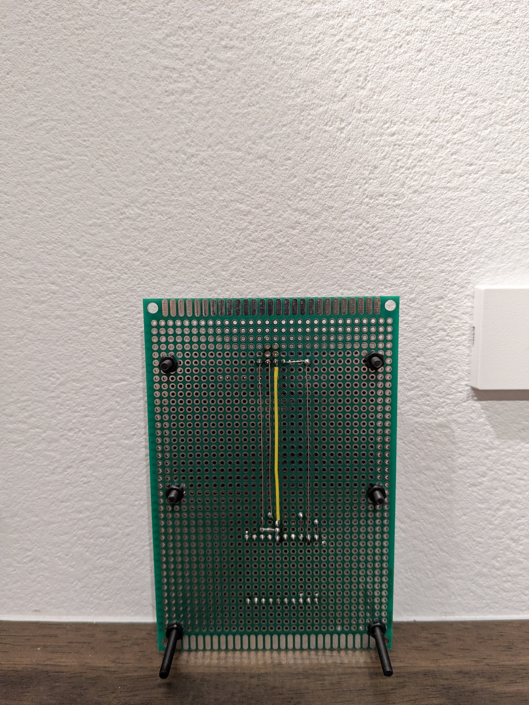

# sync_status_embed

ローカルネットワーク上のクライアントから受信したステータスを出力デバイスへ表示する、ESP8266 ベースのファームウェアです。  
サーバーとして動作し、HTTP API 経由でステータスを受け付けます。送信クライアント側の実装については、下記リポジトリを参照してください。  
[naru003/sync_status_app](https://github.com/naru003/sync_status_app)

接続する出力デバイスの種類に応じて **2つのブランチ** に分かれており、それぞれ異なる実装となっています。

---

## ブランチ構成

|                     | ブランチ             | 対象ハードウェア    | 概要                                |
| ------------------- | -------------------- | ------------------- | ----------------------------------- |
| [`LED版`](#led版)   | `variant/bit-led`    | LED × 4             | LEDの点灯パターンでバイナリ値を表示 |
| [`OLED版`](#oled版) | `variant/smart-oled` | SSD1309 128x64 OLED | OLEDにボックスとラベルを表示        |

※各ブランチの詳細（セットアップ手順・API仕様・回路図など）はそれぞれのブランチの README を参照してください。

## LED版

- **完成品のイメージ**

- **詳細**
  [README](../..//tree/variant/bit-led)

## OLED版

- **完成品のイメージ**

| 画面側                                          | 動作中                                  | 背面側                                        |
| ----------------------------------------------- | --------------------------------------- | --------------------------------------------- |
|  |  |  |

- **詳細**
  [dREADME](../..//tree/variant/smart-oled)

---

## 共通事項

- ESP8266 を使用した Webサーバーベースのファームウェア
- HTTP API (`PUT /state/{0-15}`) で出力デバイスの状態を制御
- HOSTNAME: `syncStatusServer` / mDNS: `syncStatusServer.local`

Arduino IDE のセットアップについては [esp8266/Arduino](https://github.com/esp8266/Arduino) を参照してください。

## 注意事項

本リポジトリは DMZ 内のローカルネットワーク環境での個人運用を前提として設計されており、認証・認可の実装は含まれていません。  
外部ネットワークへの公開や、セキュリティが求められる環境での使用は推奨しません。

---

## ライセンス

Copyright (c) 2026 naru003

本プロジェクトは [Creative Commons Attribution-NonCommercial 4.0 International (CC BY-NC 4.0)](https://creativecommons.org/licenses/by-nc/4.0/) の下で公開されています。

- **個人利用・非営利目的での使用・改変・再配布は許可**されています。
- **商用利用は禁止**されています。
- 再配布・改変の際は原著作者のクレジットを表示してください。

詳細は [LICENSE](./LICENSE) ファイルを参照してください。
